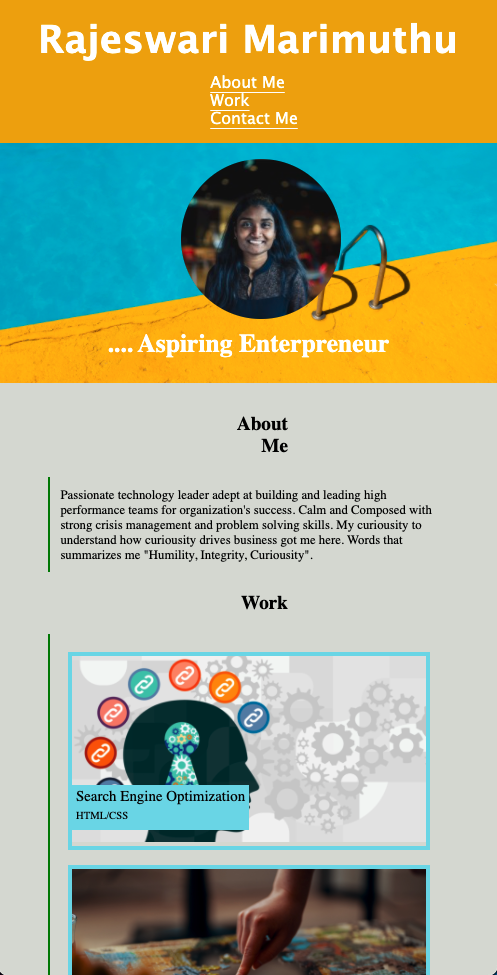
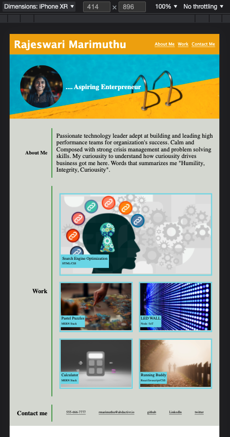

# Project Description
This webapplication is portfolio of my work. This application will be presented with responsive layout if the page is resized or viewed on various screens and devices. This is acheived by using @media query and flexbox in css. Implemented css pseudo class for hover states on teh cards at work exhibit section. 

# Application details 
GH Repo @ https://github.com/rajeswarivmarimuthu/rajeswarimarimuthu  
Hosted  @ https://rajeswarivmarimuthu.github.io/rajeswarimarimuthu/

# Tech stack used
- HTML
- CSS 
    - Flexbox
    - Media query 
    - Pseudo classes

# Desktop Homepage 

# Responsive layout when re-sized

# Layout on Mobile page 
